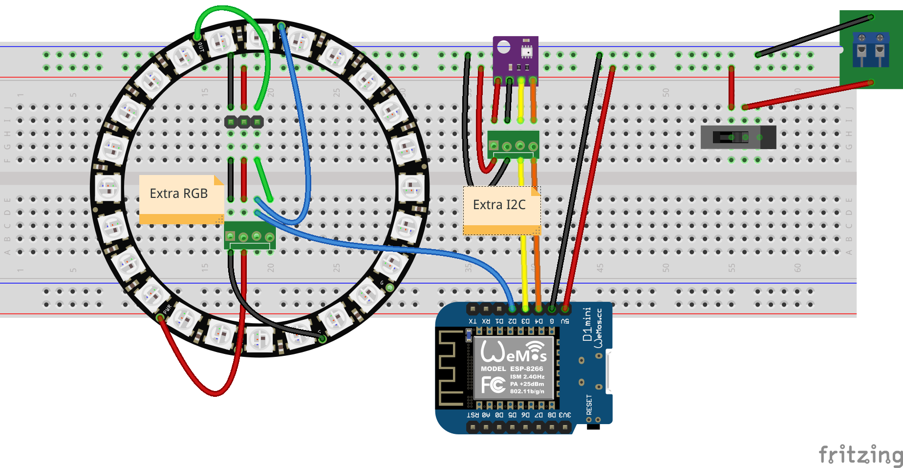
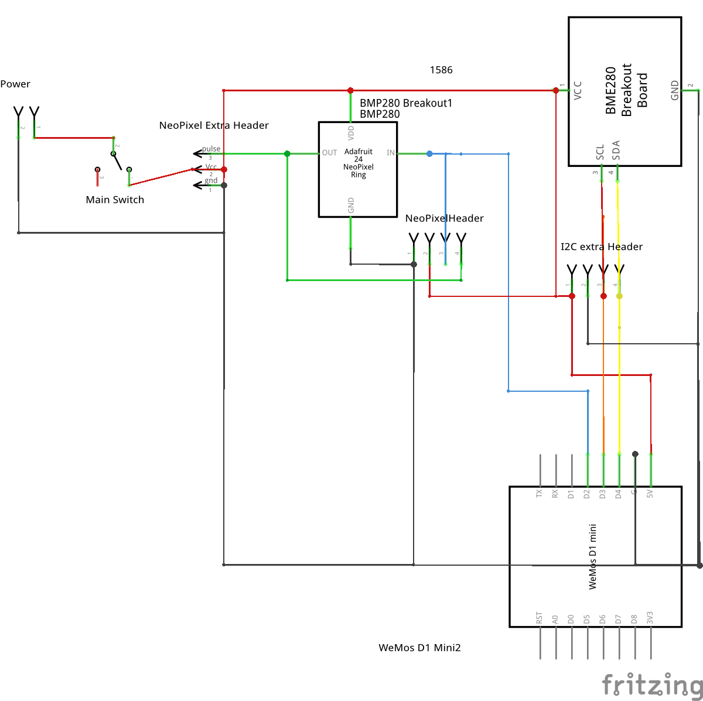
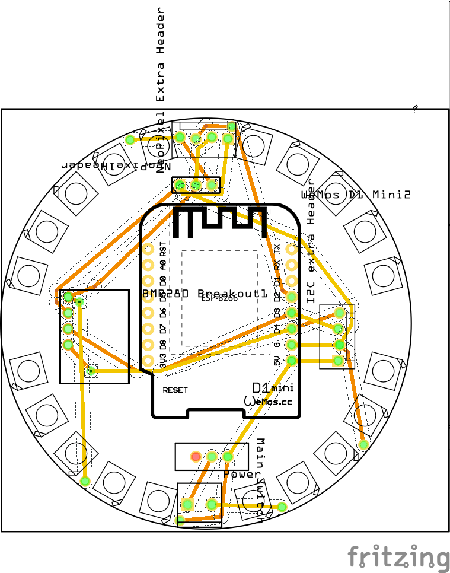
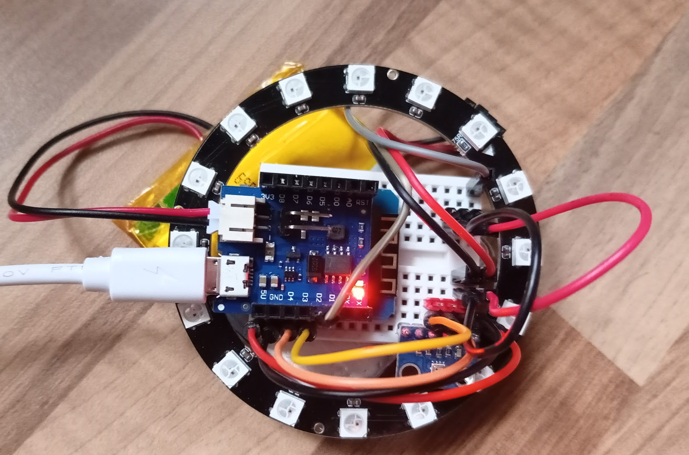
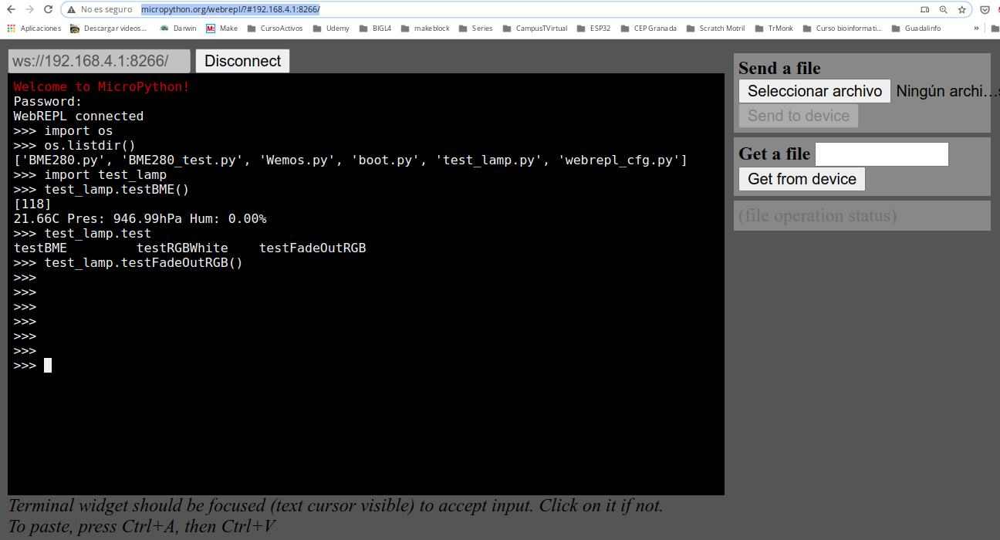
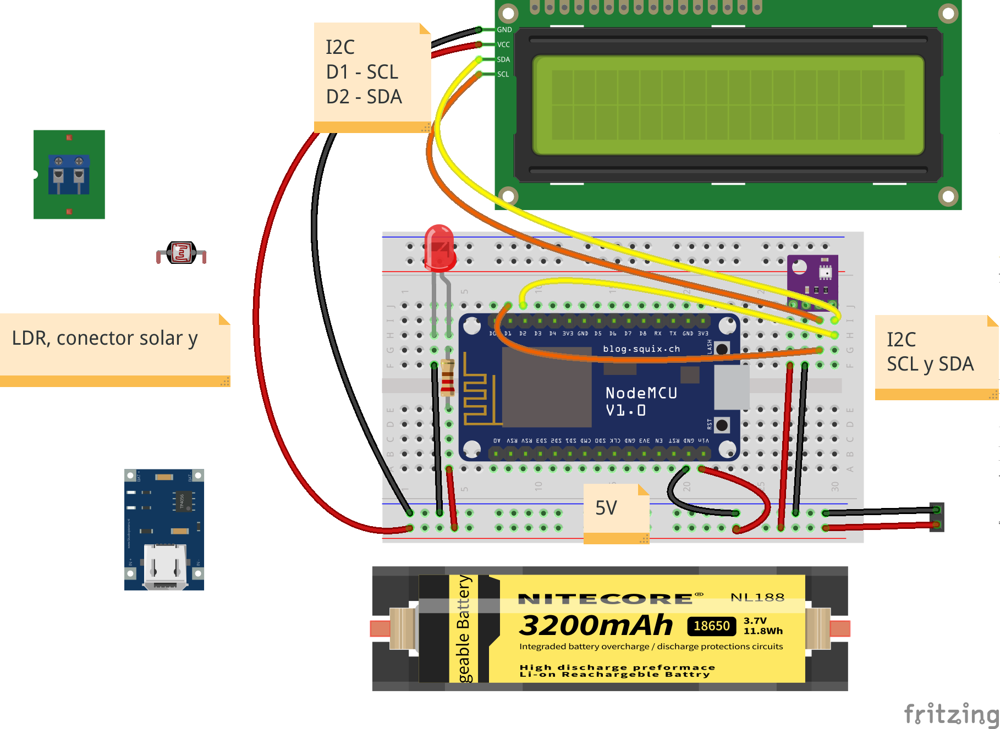
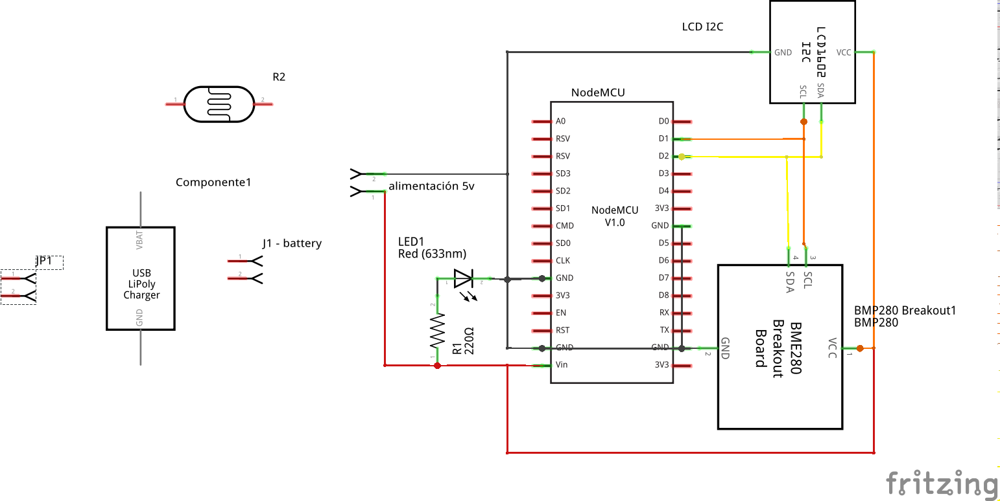

# PCBs con Fritzing 

El propósito de este proyecto es desarrollar una PCB sencilla y enviarla al programa "Your First Order Free at PCBWay" de [PCBWays](https://www.pcbway.com/)

## Mood Lamp

Lámpara RGB controlable por wifi que incluye un sensor de temperatura, humedad y presión BME280

### Componentes
* Wemos D1 mini (esp3266)
* Bme280 - sensor atomosférico
* Anillo 16/24 x neopixels 
* Alimentación por USB o externa
* Interruptor
* Conector I2C extra
* Conector Neopixel extra

### Diseño

Utilizamos Fritzing para realizar el diseño, tanto del montaje en protoboard




Como de la PCB



Siguiente paso: revisar en detalle la pcb para ver que es correcta, generar los ficheros gerber y pedir a [PCBWay](https://www.pcbway.com/) unas PCBs para probar el montaje.

### Montaje en protoboard para probar el funcionamiento



### [Código de ejemplo](./codigo/)

Utilizamos webrepl para programarla en micropython



Lectura de sensor BME280 y test de neopixels

```python
import machine
from neopixel import NeoPixel
import Wemos
import BME280_test
import time

v = '0.2'

N_Led = 16

def testBME():
    BME280_test.testBME280Wireless()

np = NeoPixel(machine.Pin(Wemos.D2), N_Led)

def testRGBWhite():
    for i in range(0, N_Led):
        np[i]=(255, 255, 255)
    np.write()

def testFadeOutRGB():
    for t in range(0,10):
        for i in range(0, N_Led):
            np[i]=(155-15*t, 155-15*t, 155-15*t)
        np.write()
        time.sleep(0.1)
    RGBoff()

def RGBoff():
    for i in range(0, N_Led):
        np[i]=(0, 0, 0)
    np.write()


testBME()
testRGBWhite()
time.sleep(1)
testFadeOutRGB()

```

[](https://youtu.be/QCqDFaScc6Q)

[Vídeo: Primeras pruebas de MoodLamp: esp8266, micropython y neopixels -> PCB con fritzing](https://youtu.be/QCqDFaScc6Q)


### v2

* Añadir arrays verticales de leds

## Estación meteo con alimentación solar V.0



